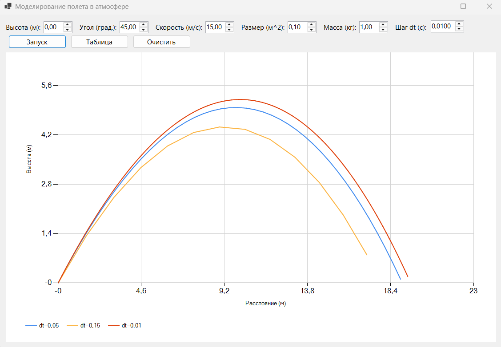

### Моделирование полёта тела в атмосфере

**Задание:**  
Реализовать приложение для моделирования полёта тела в атмосфере.  
Предусмотреть возможность ввода шага моделирования и вывода результатов.

Выполнить моделирование **без очистки предыдущих результатов** для различных шагов моделирования, сравнить траектории и заполнить таблицу.

### Результаты 

| Шаг (dt), с | Дальность, м | Макс. высота, м | Скорость в конце, м/с |
|-------------|--------------|-----------------|-----------------------|
| 1           | 9.0673       | 0.0000          | 9.0977                |
| 0.1         | 18.8842      | 4.6918          | 12.6178               |
| 0.01        | 19.5293      | 5.2041          | 12.8953               |
| 0.001       | 19.6278      | 5.2557          | 12.9461               |
| 0.0001      | 19.6334      | 5.2608          | 12.9482               |

### Выводы

В ходе работы было проведено моделирование полёта тела при различных значениях временного шага $\Delta t$. Результаты показали, что точность расчёта напрямую зависит от шага $\Delta t$: при больших значениях (1 с) получаем недостоверные результаты (нулевая высота), а при 0.01–0.001 с данные стабилизируются. Дальнейшее уменьшение шага практически не влияет на итоговые значения.