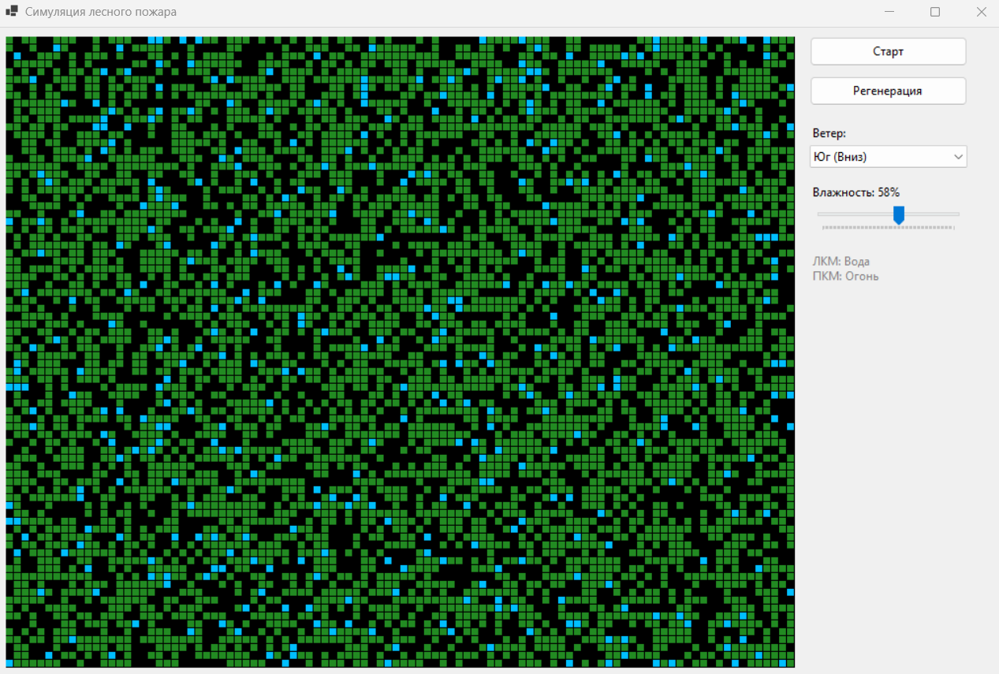

### Клеточные автоматы. Лесные пожары (GUI)

**Задание:**  
Реализовать моделирование возникновения и распространения лесных пожаров с использованием двумерного клеточного автомата.

**Требования:**
- реализовать **не менее трёх дополнительных правил** поведения системы.

### Математическая модель
Пространство модели представляет собой двумерную решетку, где каждая клетка может находиться в одном из 4 состояний. Эволюция происходит синхронно дискретными шагами. Используется окрестность Мура.

#### Состояния клеток:
```csharp
public enum CellState
{
    Empty = 0,   // Пустая земля
    Tree = 1,    // Здоровое дерево
    Burning = 2, // Горящее дерево
    Water = 3    // Вода / Преграда
}
```

### Базовые правила
- Горящее дерево на следующем шаге становится пустым.
- На пустой земле с вероятностью 1% может вырасти новое дерево.
- Дерево может загореться от молнии с вероятностью 0.01%.
- Если рядом есть горящий сосед, дерево загорается с базовой вероятностью 50%.

### Дополнительные правила
Для усложнения модели были реализованы три дополнительных правила.

#### Правило №1: Преграда
Введено состояние Water. В методе обновления модели (`UpdateModel`) прописано условие: если клетка является водой, она не может изменить свое состояние на `Burning` или `Empty`, что делает её "непроходимой" для огня.

```csharp
// Если клетка - вода, она остается водой на следующем шаге
else if (current == CellState.Water) 
{
    nextGrid[x, y] = CellState.Water;
}
```

#### Правило №2: Направление ветра
Глобальное направление ветра (Север, Юг, Запад, Восток) учитывается при расчете вероятности загорания:
- Ветер "в спину" пламени (дует на нас) повышает шанс до 95%.
- Ветер "в лицо" пламени (отгоняет огонь) снижает шанс до 5%.

```csharp
// Если ветер дует от огня на наше дерево:
if (windDx == -dx && windDy == -dy) burnChance = 0.95; 
// Если ветер дует от нас в сторону огня:
else if (windDx == dx && windDy == dy) burnChance = 0.05;
```

#### Правило №3: Влияние влажности
Ползунок влажности (0-100%) глобально снижает вероятность возгорания дерева. При высокой влажности огню труднее перекинуться на соседнюю клетку.

```csharp
// Влажность снижает шанс пожара (до -40% к вероятности)
burnChance -= (humidity * 0.4);
```
### Интерфейс системы


### Вывод
В ходе работы была реализована модель пожара. Реализованные правила ветра, влажности и преград наглядно показывают, что простые локальные правила взаимодействия клеток создают реалистичную картину распространения огня.