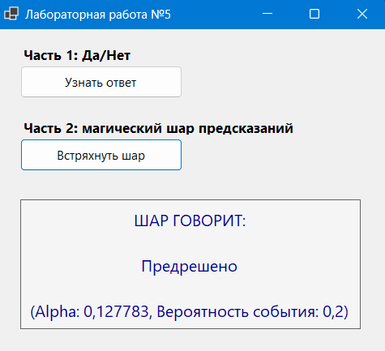

### Моделирование случайных событий (GUI)

**Часть 1:**  
Приложение «Скажи “да” или “нет”».

**Часть 2:**  
Приложение «Шар предсказаний» (Magic 8-Ball).

### Реализация

Используется мультипликативный конгруэнтный генератор случайных чисел. Генерация последовательности:
1. $x_i^* = (\beta \cdot x_{i-1}^*) \mod M$
2. $x_i = \frac{x_i^*}{M}$

Начальное значение (seed) берется из системного времени (`DateTime.Now.Ticks`).

### Моделирование событий 

Для определения исхода события используется последовательное вычитание вероятностей:

- Для одиночного события (часть 1): из случайного числа вычитается вероятность. Если полученное значение ≤0, считается, что событие наступило ("ДА"), иначе - "НЕТ".

- Для группы событий (часть 2): Из случайного числа поочередно вычитаются вероятности каждого исхода. Событие считается наступившим в тот момент (на той итерации), когда разность становится ≤0.

### Интерфейс

### Вывод

В ходе лабораторной работы было реализовано стохастическое моделирование одиночных и групповых случайных событий на языке C#. С помощью мультипликативного генератора и последовательного вычитания вероятностей были успешно созданы модели приложений "Да/Нет" и "Шар предсказаний". Все поставленные задачи выполнены, графический интерфейс работает корректно.