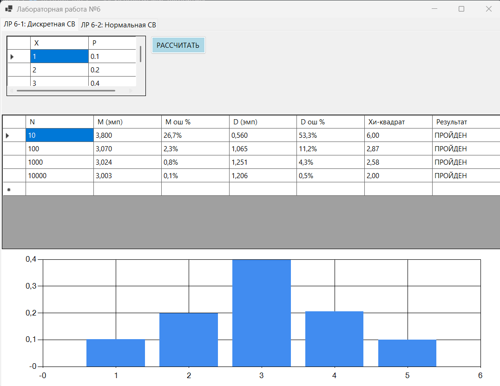
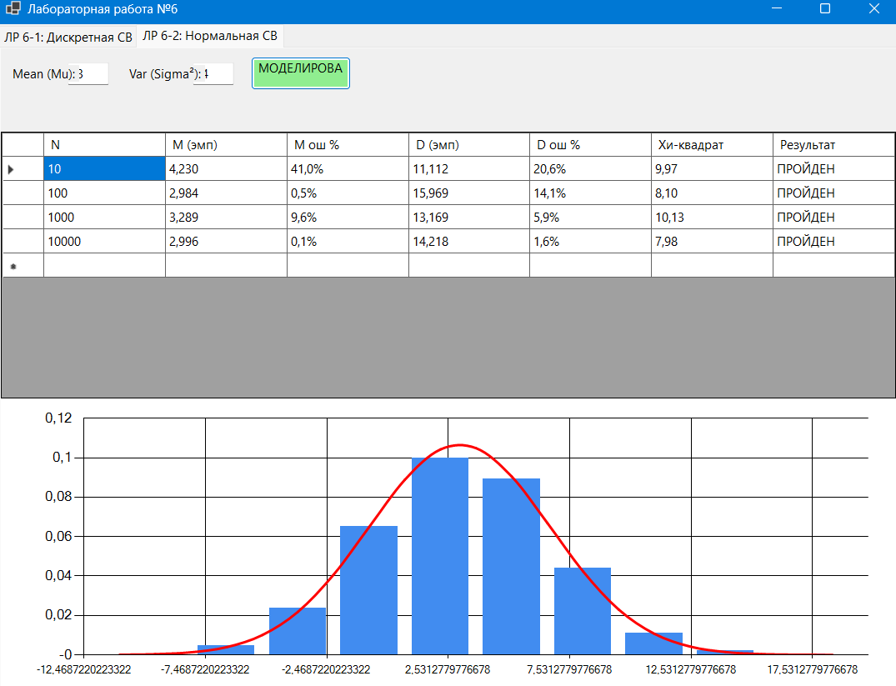

### Имитационное моделирование дискретных случайных величин (GUI)

#### lab06-1
**Задание:**
- Реализовать алгоритм проведения серии экспериментов по генерации дискретной случайной величины, заданной рядом распределения
- Вычислить эмпирические вероятности, выборочные среднее и дисперсию, их относительные погрешности
- Вычислить статистику хи-квадрат и применить критерий хи-квадрат при разных объемах выборки N  (N = 10, 100, 1 000, 10 000)
- Сделать вывод

#### lab06-2
**Задание:**
- Выполнить моделирование нормальной случайной величины любым методом. Провести статистическую обработку результатов: 

	- построить гистограмму; 
	
	- оценить точность (относительные погрешности, критерий хи-квадрат) для объемов выборки 10, 100, 1000, 10000;

   	- сделать вывод.
	

## Используемые алгоритмы
* Мультипликативный конгруэнтный метод ($M = 2^{63}$, $\beta = 4294967299$).
* Метод обратной функции (алгоритм последовательного вычитания вероятностей).
* Преобразование Бокса-Мюллера для получения стандартной нормальной величины.
* Проверка: критерий согласия Пирсона ($\chi^2$). Для вычисления теоретической вероятности нормального распределения использована аппроксимация функции ошибок Гаусса ($Erf$).

## Результаты моделирования

### 1. Сравнение точности для дискретной СВ
| Размер выборки $N$ | $\chi^2$ (Крит. 9.48) | Ош. среднего, % | Ош. дисперсии, % | Результат |
| :--- | :--- | :--- | :--- | :--- |
| 10 | 6.00 | 26.7% | 53.3% | ПРОЙДЕН |
| 100 | 2.87 | 2.3% | 11.2% | ПРОЙДЕН |
| 1000 | 2.58 | 0.8% | 4.3% | ПРОЙДЕН |
| 10000 | 2.00 | 0.1% | 0.5% | ПРОЙДЕН |

### 2. Сравнение точности для нормальной СВ
| Размер выборки $N$ | $\chi^2$ (Крит. 16.92) | Ош. среднего, %* | Ош. дисперсии, % | Результат |
| :--- | :--- | :--- | :--- | :--- |
| 10 | 10.22 | ~ | 40.2% | ПРОЙДЕН |
| 100 | 8.89 | ~ | 4.2% | ПРОЙДЕН |
| 1000 | 11.21 | ~ | 2.7% | ПРОЙДЕН |
| 10000 | 3.26 | ~ | 1.4% | ПРОЙДЕН |

## Скриншоты работы
### Моделирование Дискретной СВ

### Моделирование Нормальной СВ

## Вывод
В ходе работы были реализованы алгоритмы моделирования дискретных и непрерывных случайных величин. Анализ результатов подтвердил Закон больших чисел: с увеличением объема выборки $N$ относительные погрешности среднего значения и дисперсии закономерно уменьшаются.

Критерий $\chi^2$ на всех этапах тестирования оказался меньше критических значений, что позволяет принять гипотезу о соответствии эмпирических данных заданным теоретическим распределениям с уровнем значимости $0.05$. 