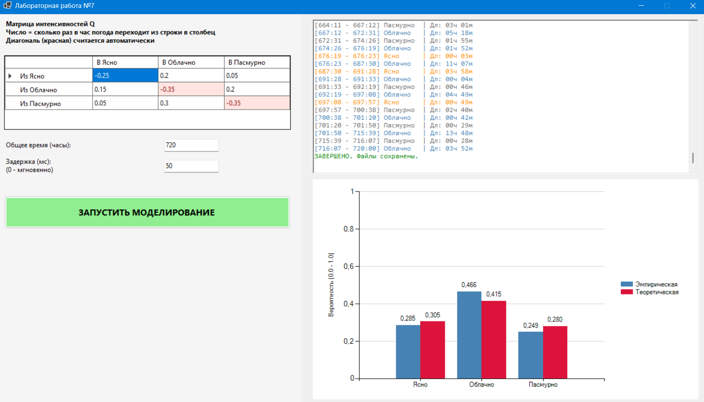

### Марковская модель погоды

**Задание:**  
Смоделировать погоду по дням:

- 1 — ясно  
- 2 — облачно  
- 3 — пасмурно  

Единица времени — **1 день**.  
Задать интенсивности переходов между состояниями.

**Требования:**
1. Выполнить моделирование в «реальном» времени с визуализацией.
2. Провести статистическую обработку результатов.
3. Сравнить эмпирическое распределение с теоретическим стационарным.
4. Сбор статистики и всей необходимой информации в .txt или .csv формат (.csv формат предпочтительней)

### Используемые алгоритмы
Моделирование основано на расчете случайных интервалов времени между сменами погоды. Длительность каждого состояния вычисляется по экспоненциальному закону на основе данных из матрицы интенсивностей $Q$. Когда это время истекает, программа выбирает новое состояние, используя вероятности переходов. 

Для оценки точности вычисляется теоретический идеал. Программа преобразует матрицу $Q$ в систему линейных уравнений и решает её методом Крамера, учитывая обязательное условие нормировки.

### Результаты моделирования
Пример результатов для матрицы $Q$ с интенсивностями переходов в час и общего времени $T = 720$ ч (30 дней).

| Состояние | Эмпирическая вер-ть | Теоретическая вер-ть | Абс. погрешность |
| :--- | :--- | :--- | :--- |
| **Ясно** | 0.285| 0.3049 | 0.0198 |
| **Облачно** | 0.4664 | 0.4146 | 0.0518 |
| **Пасмурно** | 0.2485 | 0.2805 | 0.032 |

### Интерфейс

## Вывод
В ходе лабораторной работы была построена модель Марковского процесса с непрерывным временем. Основное отличие от дискретной модели заключается в том, что переходы могут происходить в любой момент времени, а длительность пребывания в состоянии является случайной величиной. Сравнение эмпирических данных с теоретическим расчетом (через систему уравнений $\pi Q = 0$) показало сходимость результатов.